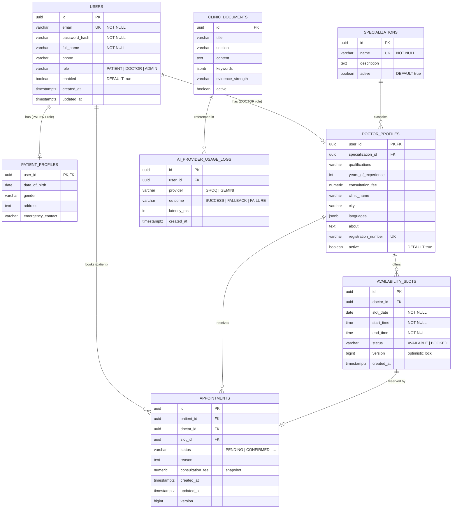

# Phase 1 — Backend Design Document

> **Scope:** Project structure, dependencies, database design, Flyway plan, DTOs, API contracts, and design decisions.  
> **Status:** Planning only — no entities, services, controllers, or security wiring yet.

---

## 1. Package Structure

```
Backend/
├── pom.xml
├── docs/
│   └── PHASE1-BACKEND-DESIGN.md
└── src/
    ├── main/
    │   ├── java/com/medislot/
    │   │   ├── DoctorAppointmentApplication.java          # Phase 2
    │   │   │
    │   │   ├── auth/                                      # Authentication module
    │   │   │   ├── controller/AuthController.java
    │   │   │   ├── dto/
    │   │   │   │   ├── LoginRequest.java
    │   │   │   │   ├── RegisterRequest.java
    │   │   │   │   └── AuthResponse.java
    │   │   │   ├── security/
    │   │   │   │   ├── JwtAuthenticationFilter.java
    │   │   │   │   ├── JwtService.java
    │   │   │   │   ├── SecurityConfig.java
    │   │   │   │   └── UserDetailsServiceImpl.java
    │   │   │   └── service/AuthService.java
    │   │   │
    │   │   ├── user/                                      # User module
    │   │   │   ├── entity/User.java
    │   │   │   ├── entity/PatientProfile.java
    │   │   │   ├── repository/UserRepository.java
    │   │   │   ├── service/UserService.java
    │   │   │   ├── dto/UserDto.java
    │   │   │   └── mapper/UserMapper.java
    │   │   │
    │   │   ├── doctor/                                    # Doctor module
    │   │   │   ├── entity/DoctorProfile.java
    │   │   │   ├── repository/DoctorRepository.java
    │   │   │   ├── service/DoctorService.java
    │   │   │   ├── controller/DoctorController.java
    │   │   │   ├── dto/DoctorDto.java
    │   │   │   └── mapper/DoctorMapper.java
    │   │   │
    │   │   ├── specialization/                            # Specialization module
    │   │   │   ├── entity/Specialization.java
    │   │   │   ├── repository/SpecializationRepository.java
    │   │   │   ├── service/SpecializationService.java
    │   │   │   ├── controller/SpecializationController.java
    │   │   │   └── dto/SpecializationDto.java
    │   │   │
    │   │   ├── availability/                              # Availability module
    │   │   │   ├── entity/AvailabilitySlot.java
    │   │   │   ├── entity/SlotStatus.java
    │   │   │   ├── repository/AvailabilitySlotRepository.java
    │   │   │   ├── service/AvailabilityService.java
    │   │   │   ├── controller/AvailabilityController.java
    │   │   │   ├── dto/
    │   │   │   │   ├── AvailabilitySlotDto.java
    │   │   │   │   └── CreateAvailabilityRequest.java
    │   │   │   └── mapper/AvailabilityMapper.java
    │   │   │
    │   │   ├── appointment/                               # Appointment module
    │   │   │   ├── entity/Appointment.java
    │   │   │   ├── entity/AppointmentStatus.java
    │   │   │   ├── repository/AppointmentRepository.java
    │   │   │   ├── service/AppointmentService.java
    │   │   │   ├── controller/AppointmentController.java
    │   │   │   ├── dto/
    │   │   │   │   ├── AppointmentDto.java
    │   │   │   │   ├── CreateAppointmentRequest.java
    │   │   │   │   ├── UpdateAppointmentStatusRequest.java
    │   │   │   │   └── RescheduleAppointmentRequest.java
    │   │   │   └── mapper/AppointmentMapper.java
    │   │   │
    │   │   ├── assistant/                                 # AI chatbot module
    │   │   │   ├── controller/AssistantController.java
    │   │   │   ├── service/
    │   │   │   │   ├── AiOrchestratorService.java
    │   │   │   │   ├── RagService.java
    │   │   │   │   └── ClinicalGuardService.java
    │   │   │   ├── provider/
    │   │   │   │   ├── AiProvider.java
    │   │   │   │   ├── GroqAiProvider.java
    │   │   │   │   └── GeminiAiProvider.java
    │   │   │   ├── entity/
    │   │   │   │   ├── ClinicDocument.java
    │   │   │   │   └── AiProviderUsageLog.java
    │   │   │   ├── repository/
    │   │   │   │   ├── ClinicDocumentRepository.java
    │   │   │   │   └── AiProviderUsageLogRepository.java
    │   │   │   └── dto/
    │   │   │       ├── AssistantChatRequest.java
    │   │   │       └── AssistantReply.java
    │   │   │
    │   │   ├── admin/                                     # Admin module
    │   │   │   ├── controller/AdminController.java
    │   │   │   └── service/AdminService.java
    │   │   │
    │   │   └── common/                                    # Shared cross-cutting code
    │   │       ├── config/
    │   │       │   ├── CorsConfig.java
    │   │       │   ├── OpenApiConfig.java
    │   │       │   └── WebClientConfig.java
    │   │       ├── dto/
    │   │       │   ├── PageResponse.java
    │   │       │   └── ApiErrorResponse.java
    │   │       ├── enums/Role.java
    │   │       ├── exception/
    │   │       │   ├── GlobalExceptionHandler.java
    │   │       │   ├── BusinessException.java
    │   │       │   ├── ConflictException.java
    │   │       │   ├── NotFoundException.java
    │   │       │   └── RateLimitExceededException.java
    │   │       └── ratelimit/
    │   │           ├── RateLimitPolicy.java
    │   │           ├── RateLimitKeyResolver.java
    │   │           ├── RateLimitService.java
    │   │           ├── RateLimitFilter.java
    │   │           └── InMemoryRateLimitStorage.java    # Redis-ready interface
    │   │
    │   └── resources/
    │       ├── application.yml
    │       ├── application-dev.yml
    │       ├── application-prod.yml
    │       └── db/migration/
    │           ├── V1__create_core_schema.sql
    │           ├── V2__create_availability_and_appointments.sql
    │           ├── V3__create_assistant_schema.sql
    │           └── V4__seed_reference_data.sql
    │
    └── test/java/com/medislot/
        ├── auth/AuthControllerTest.java
        ├── appointment/AppointmentServiceTest.java
        └── assistant/AiOrchestratorServiceTest.java
```

### Layering rule (every module)

```
Controller  →  Service  →  Repository  →  PostgreSQL
     ↑              ↑
   DTOs only    Entities + mappers (never expose entities in controllers)
```

---

## 2. Maven Dependencies

| Dependency | Purpose |
|---|---|
| `spring-boot-starter-web` | REST controllers, JSON serialization |
| `spring-boot-starter-security` | Authentication & role-based authorization |
| `jjwt-api/impl/jackson` | JWT token creation and validation |
| `spring-boot-starter-data-jpa` | Hibernate ORM + Spring Data repositories |
| `postgresql` | Supabase PostgreSQL driver |
| `flyway-core` + `flyway-database-postgresql` | Versioned schema migrations |
| `spring-boot-starter-validation` | Jakarta Bean Validation on DTOs |
| `bucket4j-core` | Token-bucket rate limiting |
| `springdoc-openapi-starter-webmvc-ui` | Swagger UI at `/swagger-ui.html` |
| `spring-boot-starter-actuator` | `/actuator/health` for Railway |
| `lombok` | Reduce boilerplate on entities (optional) |
| `spring-boot-starter-test` | JUnit 5 + Spring Test |
| `spring-security-test` | Security-aware controller tests |
| `h2` (test scope) | In-memory DB for unit/integration tests |

Full `pom.xml` is at the project root of `Backend/`.

---

## 3. Entity-Relationship Design



### Key constraints & indexes

| Constraint / Index | Reason |
|---|---|
| `UNIQUE(users.email)` | One account per email |
| `UNIQUE(doctor_profiles.registration_number)` | Medical registration uniqueness |
| `UNIQUE(availability_slots.doctor_id, slot_date, start_time)` | Prevent duplicate slots |
| `UNIQUE(appointments.slot_id) WHERE status != 'CANCELLED'` | Double-booking prevention (partial unique index) |
| `INDEX(doctor_profiles.specialization_id, city)` | Doctor search filters |
| `INDEX(availability_slots.doctor_id, slot_date, status)` | Availability listing |
| `INDEX(appointments.patient_id, status)` | Patient appointment history |
| `INDEX(appointments.doctor_id, status)` | Doctor dashboard |
| `@Version` on `availability_slots` | Optimistic locking during booking |

### ID strategy

All primary keys use **UUID** (`gen_random_uuid()` in PostgreSQL). JSON responses expose them as strings (matching the existing React `types.ts`).

---

## 4. Flyway Migration Plan

| Version | File | Contents |
|---|---|---|
| **V1** | `V1__create_core_schema.sql` | `users`, `patient_profiles`, `specializations`, `doctor_profiles`, enums/checks, core indexes |
| **V2** | `V2__create_availability_and_appointments.sql` | `availability_slots`, `appointments`, double-booking partial unique index, appointment indexes |
| **V3** | `V3__create_assistant_schema.sql` | `clinic_documents`, `ai_provider_usage_logs`, full-text search index on documents |
| **V4** | `V4__seed_reference_data.sql` | Seed specializations, demo clinic documents, optional dev admin/doctor/patient accounts |

### V1 — Core schema (outline)

```sql
-- Enums via CHECK constraints (portable, no custom PG types)
CREATE TABLE users (...);
CREATE TABLE specializations (...);
CREATE TABLE patient_profiles (...);
CREATE TABLE doctor_profiles (...);
CREATE INDEX idx_doctor_profiles_search ON doctor_profiles (specialization_id, city);
```

### V2 — Availability & appointments (outline)

```sql
CREATE TABLE availability_slots (
  ...
  status VARCHAR(20) NOT NULL DEFAULT 'AVAILABLE',
  version BIGINT NOT NULL DEFAULT 0,
  CONSTRAINT uq_slot UNIQUE (doctor_id, slot_date, start_time)
);

CREATE TABLE appointments (...);

-- Partial unique: one active appointment per slot
CREATE UNIQUE INDEX uq_appointments_active_slot
  ON appointments (slot_id)
  WHERE status <> 'CANCELLED';
```

### V3 — Assistant schema (outline)

```sql
CREATE TABLE clinic_documents (
  keywords JSONB NOT NULL DEFAULT '[]',
  evidence_strength VARCHAR(20) NOT NULL
);
CREATE INDEX idx_clinic_documents_keywords ON clinic_documents USING GIN (keywords);
```

### V4 — Seed data (outline)

- 8–12 specializations (Cardiology, Dermatology, etc.)
- 5–10 verified clinic policy documents for RAG
- **No API keys or real passwords in migrations** — seed accounts use env-driven hashes in a separate dev profile if needed

---

## 5. DTO Definitions

All public DTOs are Java **records** in module-specific `dto/` packages. See source files under `src/main/java/com/medislot/**/dto/`.

### Shared

| DTO | Fields |
|---|---|
| `PageResponse<T>` | `content`, `page`, `size`, `totalElements`, `totalPages` |
| `ApiErrorResponse` | `timestamp`, `status`, `code`, `message`, `path`, `fieldErrors?` |

### Auth

| DTO | Fields |
|---|---|
| `RegisterRequest` | `fullName`, `email`, `phone`, `password` |
| `LoginRequest` | `email`, `password` |
| `AuthResponse` | `token`, `user` |

### User

| DTO | Fields |
|---|---|
| `UserDto` | `id`, `fullName`, `email`, `phone?`, `role` |

### Doctor / Specialization

| DTO | Fields |
|---|---|
| `DoctorDto` | `id`, `fullName`, `specialization`, `qualifications`, `yearsOfExperience`, `consultationFee`, `clinicName`, `city`, `languages[]`, `about`, `registrationNumber` |
| `SpecializationDto` | `id`, `name` |

### Availability

| DTO | Fields |
|---|---|
| `AvailabilitySlotDto` | `id`, `doctorId`, `date`, `startTime`, `endTime`, `booked` |
| `CreateAvailabilityRequest` | `date`, `startTime`, `endTime`, `slotMinutes` |

### Appointment

| DTO | Fields |
|---|---|
| `AppointmentDto` | `id`, `doctorId`, `doctorName`, `specialization`, `patientId`, `patientName`, `slotId`, `date`, `startTime`, `endTime`, `status`, `reason?`, `consultationFee` |
| `CreateAppointmentRequest` | `doctorId`, `slotId`, `reason?` |
| `UpdateAppointmentStatusRequest` | `status` |
| `RescheduleAppointmentRequest` | `slotId` |

### Assistant

| DTO | Fields |
|---|---|
| `AssistantChatRequest` | `message` |
| `AssistantReply` | `answer`, `sources[]`, `sufficientEvidence`, `disclaimer` |
| `AssistantSource` | `title`, `section?`, `evidenceStrength` |

> **Frontend alignment:** These DTOs mirror `Frontend/src/lib/api/types.ts` exactly so the React app works without changes when `VITE_USE_MOCK_API=false`.

---

## 6. API Contracts

Base URL: `/api/v1`  
Auth header: `Authorization: Bearer <jwt>` (except public endpoints)

### Standard error envelope

```json
{
  "timestamp": "2026-07-30T12:00:00Z",
  "status": 400,
  "code": "VALIDATION_ERROR",
  "message": "Please check the highlighted fields.",
  "path": "/api/v1/auth/register",
  "fieldErrors": {
    "email": "must be a well-formed email address"
  }
}
```

### HTTP 429 envelope

```json
{
  "timestamp": "2026-07-30T12:00:00Z",
  "status": 429,
  "code": "RATE_LIMIT_EXCEEDED",
  "message": "Too many requests. Please try again later.",
  "path": "/api/v1/auth/login"
}
```

**Response headers:** `Retry-After`, `X-RateLimit-Limit`, `X-RateLimit-Remaining`, `X-RateLimit-Reset`

---

### 6.1 Auth

#### `POST /api/v1/auth/register` — Public

| | |
|---|---|
| **Rate limit** | 3 req/min per IP |
| **Role created** | PATIENT only (doctors/admins created by admin) |
| **Request body** | `RegisterRequest` |
| **Success** | `201 Created` → `AuthResponse` |
| **Errors** | `400` validation, `409` email exists, `429` rate limit |

#### `POST /api/v1/auth/login` — Public

| | |
|---|---|
| **Rate limit** | 5 req/min per IP |
| **Request body** | `LoginRequest` |
| **Success** | `200 OK` → `AuthResponse` |
| **Errors** | `401` invalid credentials, `429` rate limit |

---

### 6.2 Doctors

#### `GET /api/v1/doctors` — Public (optional auth)

| | |
|---|---|
| **Rate limit** | 30 req/min per user or IP |
| **Query params** | `query`, `specialization`, `city`, `maxFee`, `page` (default 0), `size` (default 6) |
| **Success** | `200 OK` → `PageResponse<DoctorDto>` |

#### `GET /api/v1/doctors/{doctorId}` — Public

| | |
|---|---|
| **Rate limit** | 30 req/min per user or IP |
| **Success** | `200 OK` → `DoctorDto` |
| **Errors** | `404` not found |

#### `GET /api/v1/doctors/cities` — Public *(supports frontend filter UI)*

| | |
|---|---|
| **Success** | `200 OK` → `string[]` distinct cities |

---

### 6.3 Availability

#### `POST /api/v1/doctors/availability` — DOCTOR

| | |
|---|---|
| **Rate limit** | 20 req/min per doctor |
| **Request body** | `CreateAvailabilityRequest` |
| **Success** | `201 Created` → `AvailabilitySlotDto[]` |
| **Errors** | `400` invalid window, `409` slot clash |

#### `GET /api/v1/doctors/{doctorId}/availability` — Public

| | |
|---|---|
| **Rate limit** | 30 req/min |
| **Success** | `200 OK` → `AvailabilitySlotDto[]` (future slots, sorted ascending) |

---

### 6.4 Appointments

#### `POST /api/v1/appointments` — PATIENT

| | |
|---|---|
| **Rate limit** | 5 req/min per patient |
| **Request body** | `CreateAppointmentRequest` |
| **Success** | `201 Created` → `AppointmentDto` |
| **Errors** | `404` slot/doctor not found, `409` slot already booked |
| **Transaction** | Locks slot → validates → creates appointment → marks slot BOOKED |

#### `GET /api/v1/appointments/my` — PATIENT / DOCTOR / ADMIN

| | |
|---|---|
| **Rate limit** | 30 req/min |
| **Query params** | `page`, `size`, `status?` |
| **Behavior** | PATIENT sees own bookings; DOCTOR sees assigned; ADMIN sees all |
| **Success** | `200 OK` → `PageResponse<AppointmentDto>` |

#### `PATCH /api/v1/appointments/{appointmentId}/status` — DOCTOR (confirm/reject/complete)

| | |
|---|---|
| **Rate limit** | 10 req/min |
| **Request body** | `{ "status": "CONFIRMED" \| "REJECTED" \| "COMPLETED" }` |
| **Success** | `200 OK` → `AppointmentDto` |
| **Errors** | `403` wrong role, `404`, `409` invalid transition |

#### `PATCH /api/v1/appointments/{appointmentId}/reschedule` — PATIENT

| | |
|---|---|
| **Rate limit** | 5 req/min |
| **Request body** | `{ "slotId": "<uuid>" }` |
| **Success** | `200 OK` → `AppointmentDto` |
| **Errors** | `409` new slot taken |

#### `DELETE /api/v1/appointments/{appointmentId}` — PATIENT

| | |
|---|---|
| **Rate limit** | 5 req/min |
| **Success** | `204 No Content` |
| **Side effect** | Sets status CANCELLED, frees slot |

---

### 6.5 Assistant

#### `POST /api/v1/assistant/chat` — Authenticated (all roles)

| | |
|---|---|
| **Rate limit** | 5 req/min **and** 50 req/day per user |
| **Request body** | `{ "message": "..." }` |
| **Success** | `200 OK` → `AssistantReply` |
| **Safety** | Rejects diagnosis/prescription requests before calling AI |

---

### 6.6 Admin *(Phase 6 — listed for completeness)*

| Method | Path | Role |
|---|---|---|
| `GET` | `/api/v1/admin/doctors` | ADMIN |
| `GET` | `/api/v1/admin/patients` | ADMIN |
| `GET` | `/api/v1/admin/appointments` | ADMIN |
| `GET` | `/api/v1/specializations` | Public |

---

## 7. Important Design Decisions

### 7.1 Modular monolith, not microservices

All modules live in one Spring Boot JAR deployed to Railway. Boundaries are **package-level**, not network-level. This keeps the internship project deployable and debuggable while still demonstrating clean architecture.

### 7.2 DTOs at the API boundary

JPA entities (`User`, `Appointment`, etc.) never appear in controller method signatures. MapStruct-style manual mappers convert entity → DTO inside services. This prevents lazy-loading leaks, hides password hashes, and lets the API evolve independently of the schema.

### 7.3 UUID primary keys

UUIDs avoid sequential ID guessing and map cleanly to the frontend's `string` ID fields. PostgreSQL `gen_random_uuid()` generates them at insert time.

### 7.4 Double-booking: defense in depth

Three layers work together:

1. **Optimistic lock** (`@Version`) on `availability_slots` — concurrent updates fail fast.
2. **Status check** — slot must be `AVAILABLE` inside the transaction.
3. **Partial unique index** — `UNIQUE(slot_id) WHERE status <> 'CANCELLED'` on appointments as a database-level safety net.

Booking flow uses `@Transactional` with `PESSIMISTIC_WRITE` lock on the slot row (or fails on version mismatch → retry once → 409).

### 7.5 Rate limiting: Redis-ready abstraction

```
RateLimitFilter
    → RateLimitService
        → RateLimitStorage (interface)
            → InMemoryRateLimitStorage   ← Phase 4
            → RedisRateLimitStorage      ← future swap
```

Bucket4j `Bucket` instances are keyed by `(policy, identifier)` where identifier is IP or user ID depending on the endpoint. Headers are set in a single `RateLimitFilter` before the controller chain.

### 7.6 AI provider orchestration

```
AssistantController
    → ClinicalGuardService (block diagnosis/prescription)
    → RagService (retrieve clinic documents)
    → AiOrchestratorService
        → GroqAiProvider (primary, with timeout + retries + circuit breaker)
        → GeminiAiProvider (fallback ONLY on Groq failure)
```

Gemini is **never** called on the happy path. Provider usage is logged to `ai_provider_usage_logs`. API keys come from environment variables (`GROQ_API_KEY`, `GEMINI_API_KEY`).

### 7.7 Configuration via environment variables

No credentials in source code or Flyway scripts:

| Variable | Used by |
|---|---|
| `DATABASE_URL` | Supabase PostgreSQL (Railway injects this) |
| `JWT_SECRET` | Token signing |
| `JWT_EXPIRATION_MS` | Token TTL |
| `GROQ_API_KEY` | Primary AI provider |
| `GEMINI_API_KEY` | Fallback AI provider |
| `CORS_ALLOWED_ORIGINS` | Vercel frontend URL |

### 7.8 Frontend compatibility

The existing React app at `Frontend/src/lib/api/types.ts` defines the contract. Backend DTO field names use **camelCase JSON** (Spring Boot default) to match TypeScript interfaces exactly.

### 7.9 Pagination convention

Zero-based `page` parameter (matching the frontend's `page = 0` default). Response uses `PageResponse<T>` instead of Spring's native `Page<T>` to keep a stable, simple JSON shape.

### 7.10 Appointment status transitions

```
PENDING  → CONFIRMED | REJECTED | CANCELLED (patient)
CONFIRMED → COMPLETED | CANCELLED (patient, if before slot)
REJECTED  → (terminal)
COMPLETED → (terminal)
CANCELLED → (terminal, frees slot)
```

Doctors can move `PENDING → CONFIRMED/REJECTED` and `CONFIRMED → COMPLETED`. Patients can `CANCEL` or `RESCHEDULE` (reschedule resets to PENDING).

---

## Phase Roadmap (upcoming)

| Phase | Deliverables |
|---|---|
| **2** | Application entry point, `application.yml`, Flyway V1–V4, entities, repositories |
| **3** | Auth module — JWT, Spring Security, register/login |
| **4** | Doctor, specialization, availability modules + rate limiting |
| **5** | Appointment module + double-booking transaction |
| **6** | Assistant module (Groq/Gemini orchestration, RAG) + admin APIs |
| **7** | Global exception handler, Swagger, tests, Postman collection, Railway config |

---

*Phase 1 complete. Awaiting your instruction to proceed to Phase 2.*
