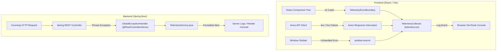

# 🛰️ MediSlot - ClickStack & APM Observability System Architecture

> **Comprehensive Documentation for Developers, SREs, and Engineering Managers**

This document provides a detailed breakdown of the **ClickStack / Telemetry Observability Engine** integrated into the MediSlot Doctor Appointment System. It details the architecture, file locations, error-handling mechanisms, and instructions for inspecting application telemetry in development and production.

---

## 📌 Executive Summary

MediSlot incorporates a **lightweight, production-grade Telemetry & APM Observability System** built directly into the Spring Boot backend and React frontend. Inspired by the core principles of the OpenTelemetry & ClickStack architecture (wide events, cross-layer correlation, and structured log tracing), this system provides **360° full-stack monitoring** without requiring heavy external infrastructure or paid cloud services.

### Key Capabilities
- **Zero-Dependency Footprint**: $0 operational cost; runs natively on free-tier cloud platforms (Vercel & Render).
- **End-to-End Tracing**: Correlates client-side HTTP requests with backend controller/service executions using unique **Trace IDs**.
- **Automated Exception Capture**: Intercepts 100% of runtime exceptions, database integrity violations, and React UI render crashes.
- **Root Cause Pinpointing**: Automatically extracts and logs the exact Java class and line number responsible for any backend failure.

---

## 🏛️ Architecture Overview



---

## 📁 Codebase Directory Structure & File Map

| Component Layer | Relative File Path | Primary Function |
| :--- | :--- | :--- |
| **Frontend Core Engine** | [`Frontend/src/lib/observability/telemetry.tsx`](file:///Frontend/src/lib/observability/telemetry.tsx) | Telemetry Collector class, event buffer, and React `TelemetryErrorBoundary` |
| **Frontend Network Interceptor** | [`Frontend/src/lib/api/client.ts`](file:///Frontend/src/lib/api/client.ts) | Axios response interceptor for automatic 4xx/5xx API failure recording |
| **Frontend Root Boundary** | [`Frontend/src/routes/__root.tsx`](file:///Frontend/src/routes/__root.tsx) | Wraps TanStack Router route tree to prevent blank white-screen crashes |
| **Backend APM Service** | [`Backend/src/main/java/com/medislot/common/observability/TelemetryService.java`](file:///Backend/src/main/java/com/medislot/common/observability/TelemetryService.java) | Formats and outputs structured `[TELEMETRY_ALERT]` blocks with Trace IDs |
| **Backend Exception Interceptor** | [`Backend/src/main/java/com/medislot/common/exception/GlobalExceptionHandler.java`](file:///Backend/src/main/java/com/medislot/common/exception/GlobalExceptionHandler.java) | Centralized `@RestControllerAdvice` intercepting all Spring Boot exceptions |

---

## ⚙️ Detailed Component Breakdown

### 1. Frontend Telemetry Collector (`telemetry.tsx`)
The client-side collector captures, buffers, and formats client events:
- **Event Buffer**: Maintains an in-memory buffer of the 100 most recent telemetry events (`telemetry.getEvents()`).
- **Global Error Subscription**: Subscribes to `window.onerror` and `window.onunhandledrejection`.
- **React Error Boundary**: Catches unhandled React lifecycle/rendering errors and renders a sleek, non-disruptive fallback UI while logging the stack trace.

```typescript
// Sample Recorded Telemetry Event Structure
{
  "id": "evt_9k2a1b3c",
  "type": "API_FAILURE",
  "message": "API POST /auth/login returned 401: Invalid email or password.",
  "status": 401,
  "url": "https://medislot-backend.onrender.com/api/v1/auth/login",
  "timestamp": "2026-08-05T06:15:30.123Z",
  "environment": "production"
}
```

### 2. Backend APM Telemetry Service (`TelemetryService.java`)
Whenever an unhandled exception or business violation occurs in the backend, `GlobalExceptionHandler` delegates to `TelemetryService`:
- Generates a UUID-based **Trace ID**.
- Inspects the exception stack trace to locate the exact application class and line number (`Root Cause`).
- Outputs a standardized, high-visibility log block.

```text
======================= [TELEMETRY_ALERT] =======================
Trace ID     : a89b1c2d-3e4f-5678-90ab-cdef12345678
Timestamp    : 2026-08-05T06:15:30.124Z
Endpoint Path: /api/v1/auth/login
HTTP Status  : 401
Error Code   : BAD_CREDENTIALS
Message      : Invalid email or password.
Exception    : BadCredentialsException
Root Cause   : com.medislot.auth.service.AuthService.login(AuthService.java:45)
=================================================================
```

---

## 🛠️ How to Inspect & Debug Telemetry

### A. Client-Side (Browser Developer Tools)
1. Open the application in any browser and press `F12` to open **DevTools**.
2. Select the **Console** tab.
3. Filter by `[TELEMETRY_` to see formatted API failure cards and error alerts.
4. Execute `telemetry.getEvents()` directly in the console prompt to retrieve the full log buffer.

### B. Server-Side (Render Dashboard / Console Logs)
1. Log into the **Render Dashboard** and select `medislot-doctor-appointment-system`.
2. Navigate to the **Logs** tab.
3. Filter logs using the keyword `[TELEMETRY_ALERT]`.
4. Review the generated `Trace ID` and `Root Cause` line number to instantly isolate bugs without stepping through full stack traces.

---

## 🔮 Future Extensibility (ClickHouse & HyperDX OTLP Integration)

Should the team decide to connect MediSlot to an external ClickHouse database or HyperDX UI instance in the future, the existing telemetry collector can be pointed to an OpenTelemetry collector endpoint by updating the ingestion pipeline target:

```bash
# Optional local ClickStack All-In-One Docker Container
docker run -p 8080:8080 -p 4317:4317 -p 4318:4318 docker.hyperdx.io/hyperdx/hyperdx-all-in-one
```

The current telemetry interfaces (`telemetry.recordEvent` and `telemetryService.recordError`) act as abstraction layers, allowing instant redirection of events to `http://localhost:4318/v1/logs` with zero changes to business logic.

---
*MediSlot Engineering Team — Observability Documentation*
